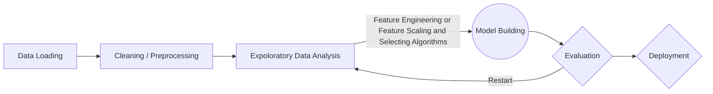
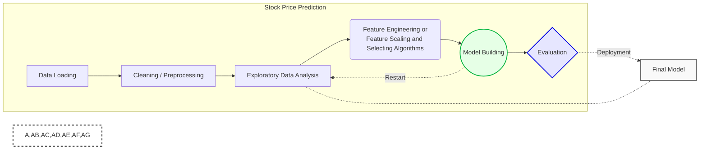

## Credit Card Default Prediction 

#### Frame

## About Project :
  The Credit Card Default Prediction project is aimed at predicting whether a credit card user is likely to default on their payment, using machine learning techniques. Credit card default is a common problem in the financial industry, and can lead to significant financial losses for both the credit card issuer and the user.

  To develop an effective credit card default prediction model, the project will involve collecting and analyzing a large dataset of credit card transactions and user information. The dataset will include a range of features such as user demographics, payment history, credit limits, and other relevant factors.
  
  
## Abstract :
  The Credit Card Default Prediction project is aimed at developing a machine learning model that can accurately predict whether a credit card user is likely to default on their payment. This project involves collecting and analyzing a large dataset of credit card transactions and user information, preprocessing and cleaning the data, and training various machine learning algorithms to determine the best approach for credit card default prediction. The best-performing algorithm will be used to develop a credit card default prediction model, which can be deployed and used by financial institutions to predict and manage credit risk. The model will be evaluated on a test dataset to ensure its accuracy and effectiveness. This project has important implications for the financial industry, as it can help prevent defaults and improve financial stability for both the credit card issuer and the user.
  

 ### 📑 About The Dataset : 'default of credit card clients' 
  This project is aimed at predicting the case of customers' default payments in Taiwan. From the perspective of risk management, the result of predictive accuracy of the estimated probability of default will be more valuable than the binary result of classification - credible or not credible clients. We can use the K-S chart to evaluate which customers will default on their credit card payments.
 
 | Feature   | Description                                                                                                                                                                                                                                               |
|-----------|-----------------------------------------------------------------------------------------------------------------------------------------------------------------------------------------------------------------------------------------------------------|
| X1        | Amount of the given credit (NT dollar): it includes both the individual consumer credit and his/her family (supplementary) credit.                                                                                                                         |
| X2        | Gender (1 = male; 2 = female).                                                                                                                                                                                                                            |
| X3        | Education (1 = graduate school; 2 = university; 3 = high school; 4 = others).                                                                                                                                                                             |
| X4        | Marital status (1 = married; 2 = single; 3 = others).                                                                                                                                                                                                     |
| X5        | Age (year).                                                                                                                                                                                                                                               |
| X6 - X11  | History of past payment. We tracked the past monthly payment records (from April to September, 2005) as follows: X6 = the repayment status in September, 2005; X7 = the repayment status in August, 2005; . . .;X11 = the repayment status in April, 2005. |
| X12 - X17 | Amount of bill statement (NT dollar). X12 = amount of bill statement in September, 2005; X13 = amount of bill statement in August, 2005; . . .; X17 = amount of bill statement in April, 2005.                                                          |
| X18 - X23 | Amount of previous payment (NT dollar). X18 = amount paid in September, 2005; X19 = amount paid in August, 2005; . . .;X23 = amount paid in April, 2005.                                                                                                  |
 
 
 #### Objective : 
 
 The objective of this Credit Card Default Prediction project is to develop a machine learning model that can accurately predict credit card defaults and identify high-risk customers based on a dataset of credit card transactions and user information. The project aims to provide insights into the key factors that contribute to credit card defaults, develop a user-friendly dashboard or interface for financial institutions, and contribute to the development of a more stable and reliable credit system.
 
 
 

#### The Path : 

